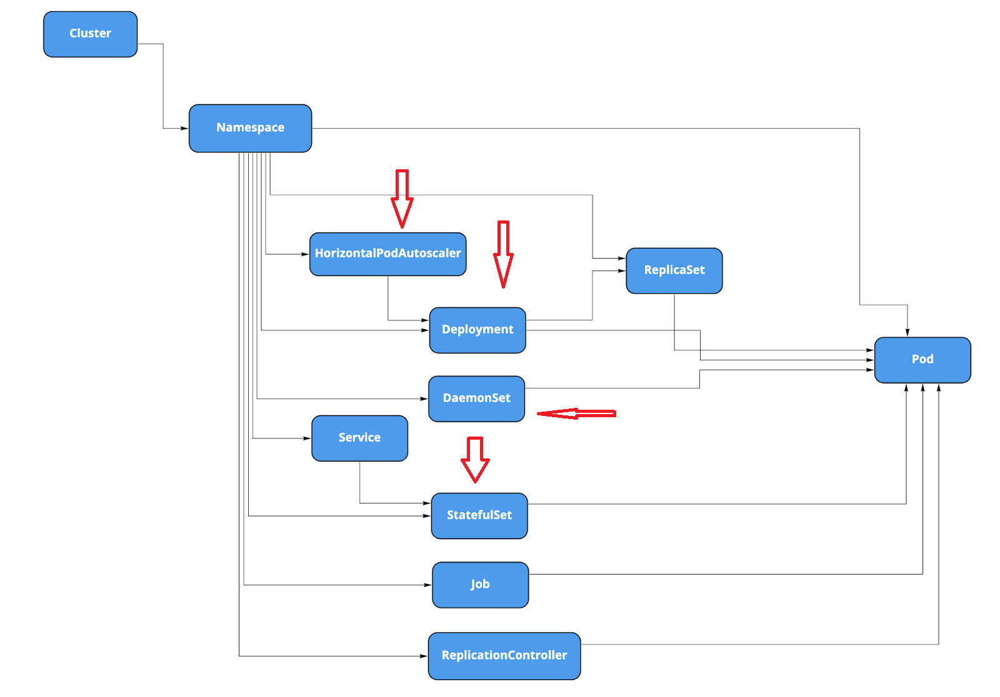
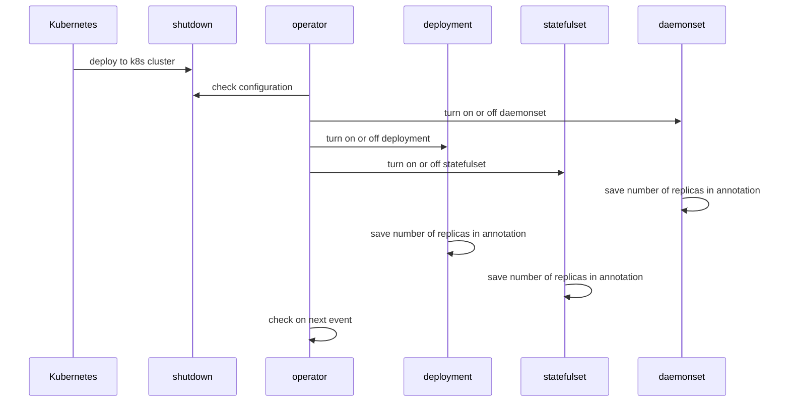

<pre>

</pre>




## Steps for running operator in our k8s cluster

### Build and push image 

```bash
docker image build . -t djkormo/shutdown-operator:latest 
docker image push djkormo/shutdown-operator:latest
```

### Deploy crd

```console 
kubectl apply -f crd/crd.yaml 
```

### Create namespace for the operator

```console 
kubectl create ns shutdown-operator
```


### Deploy operator permission

```console 
kubectl apply -f deploy/rbac 
```

### Deploy the operator

```console 
kubectl apply -f deploy/operator.yaml 
```

### Deploy sample CR (primer object)

```console 
kubectl apply -f test/shutdown.yaml 
```

### Check 

``` 
kubectl get deploy,pod -n shutdown-operator 
```

#### In case of troubles look into operator logs

```
operator_pod=$(kubectl get pod -n shutdown-operator -L app=shutdown-operator -o name | grep operator | head -n1)
kubectl get ${operator_pod} -n shutdown-operator
kubectl -n shutdown-operator logs ${operator_pod} -f 
```

```
kubectl -n shutdown-operator describe ${operator_pod}
```


Check events

```
kubectl get events -n shutdown-operator --sort-by=.metadata.creationTimestamp
```

```
kubectl -n shutdown-operator exec ${operator_pod} -it -- bash
curl http://localhost:8080/healthz

```

Redeploy operator
```
kubectl replace -R -f deploy/ --force
```

Test manifest

```yaml
apiVersion: djkormo.github/v1alpha1
kind: Shutdown
metadata:
  name: shutdown-my-namespace
  namespace: project-operator
spec:
  namespace: my-namespace
  dry-run: false # dry run mode , default false
  state: true # turning off mode, default true
  deployments: true # turn off deployments, default false
  daemonsets: true # turn off daemonsets , default false
  statefulsets: true # turn off daemonsets statefulset default false 
  label-selector: "shutdown-app=deployment" # for filtering objects
  node-selector: "shutdown-non-existing-test"  # for daemonset control

```


Check RBAC

```
kubectl auth can-i -n shutdown-operator create events --as=system:serviceaccount:shutdown-operator:shutdown-operator
```

Add release version as git tag

```
git tag v0.1.0
git push origin --tags

```

## Helm

```console
helm repo add  djkormo https://djkormo.github.io/k8s-shutdown-operator/

helm repo update

helm search repo shutdown-operator

helm install shutdown-operator djkormo/shutdown-operator -n shutdown-operator
```


Based on 

https://kopf.readthedocs.io/en/latest/walkthrough/creation/

https://github.com/kubernetes-client/python/blob/master/examples/deployment_crud.py

https://github.com/kubernetes-client/python/issues/1378

https://stackoverflow.com/questions/53929693/how-to-scale-kubernetes-daemonset-to-0

https://docs.github.com/en/actions/learn-github-actions/understanding-github-actions

https://stackoverflow.com/questions/52387656/how-can-i-get-pods-by-label-using-the-python-kubernetes-api


